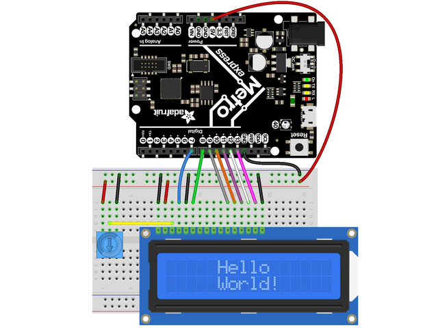
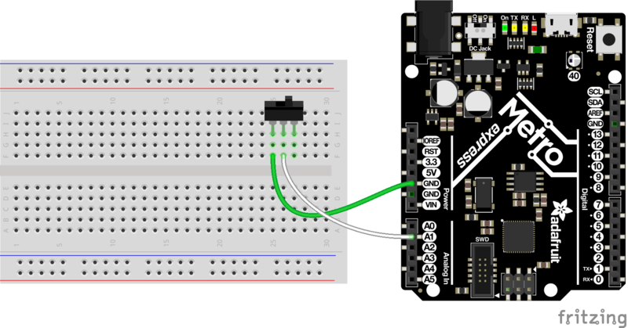
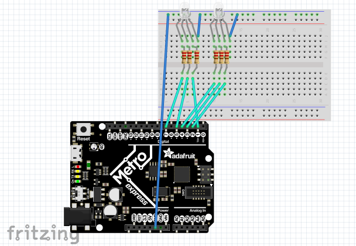
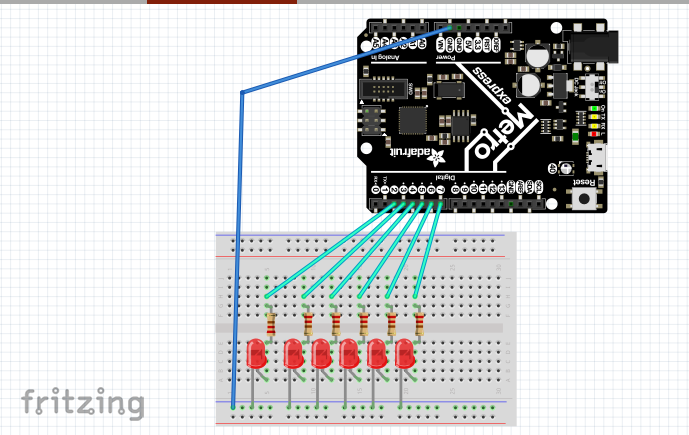

# My CircuitPython assignments

## LED Blink Fade

##### Objective 

The first assignment I did was and LED blink/fade
project, I used the CircuitPython metro board
to make an LED blink and then fade in and out

##### Pictures

 

* I got this from [Dr. Shields](https://github.com/DoctorShields/CircuitPython)

```python
led = pulseio.PWMOut(board.D13, frequency=5000, duty_cycle=0)    # sets up pin.

while True:
    for i in range(100):
        # PWM LED up and down
        if i < 50:
```

* This is a portion of my code that is helpful in doing this assignment

##### Problems
The main problem that I faced in this project was actually the writing, I had to do some research to reacquaint myself with how to wire and LED correctly, but other than that there were very few problems that I face while doing this assignment. (I had one time when I got an error from the console, however, I just needed to restart the board. 
##### What I Learned!
For starters, I learned how to properly wire and how to create basic code on CircuitPython but I also re-discovered how to make an LED blink because I had forgotten how to do so.


## Servo

##### Objective

The next assignment I did was a servo assignment.
I basically just made a servo turn by touching 2
different wires which made it go in either
direction, I set it to 180 degrees which meant it
went from one end of the servo to the other.

##### Pictures


* I got this from [Dr. Shields](https://github.com/DoctorShields/CircuitPython)

```python
# create a PWMOut object on Pin A2.
pwm = pulseio.PWMOut(board.D13)
duty_cycle=2 ** 15, frequency=50)

# Create a servo object, my_servo.
my_servo = servo.Servo(pwm)
```
* This code snippet gives you a start to making the servo rotate. Next, you just need angles and degrees to make it turn.

##### Problems
The main problem I faced in this assignment, was figuring out how to get the servo to turn. I already had a pretty good idea of how to wire a servo since that was my main project last year, however, it took me a few tries to get the servo to turn the number of degrees I wanted, which was very annoying. Another thing I had a problem with was figuring out how to make it turn by touching the wires. It took me about half a day and the help from other GitHub pages to figure it out.
##### What I Learned!
I learned how to once again make a servo turn but this time using my fingers to touch a wire. 


## LCD Screen and button

##### Objective

The last assignment I did was I hooked up a button
and LCD screen to my metro board and then created a
code that allows it to count up by one on the LCD
if the button is pressed. The most difficult part was
trying to do it without an excessive use of time.sleep

##### Pictures



* __Ignore the potentionmeter...__

```python
from lcd.lcd import LCD
from lcd.i2c_pcf8574_interface import I2CPCF8574Interface

from lcd.lcd import CursorMode
button_a = digitalio.DigitalInOut(board.BUTTON_A)
button_a.direction = digitalio.Direction.INPUT
button_a.pull = digitalio.Pull.DOWN

button_b = digitalio.DigitalInOut(board.BUTTON_B)
button_b.direction = digitalio.Direction.INPUT
button_b.pull = digitalio.Pull.DOWN
```

* This bit of code will help you understand how to set up your buttons for the LCD assignment

* __Notice:__
```python
(from lcd.i2c_pcf8574_interface import I2CPCF8574Interface) 
```

* __This bit of code is crucial for the function to work__

##### Problems
In this assignment I had 2 problems, getting the LCD screen to print what I wanted, to get the button to count up without using a time.sleep constantly. This assignment was one of the more difficult ones because I had to make a code that didn’t use time.sleep as much, which, trust me, was very hard because up until now, time.sleep was the only delay type of tool I used (besides delay on Arduino). Getting what I wanted on the actual LCD screen was super hard for me. I didn't get it working until the very, infact I used the serial monitor to do all the numeric stuff involved. 
##### What I Learned!
This assignment taught me how to use the LCD to count up and how to wire a button to it to do so. I also taught me to design a code that counted upon click instead of on delay which was helpful and interesting. 


## Photo Interrupter

##### Objective

In this assignment, I used a photo interrupter to print the
number of interrupts o the serial monitor. It was a bit
difficult to not get it to just print out random interrupt
numbers.

##### Pictures



```python
photo_state = photo.value
    if photo_state and not last_state:
        value = value + 1
        # print("# of interrupts:")
        # print(value)
    last_state = photo_state
    remaining = max + start - time.monotonic()
    if remaining <= 0:
        print("# of interrupts:", (value))
        max += 4
        value = 0
```

* After I finished this bit of code, the whole assignment got so much easier. Use this, it will help!

##### Problems
The only problem I had with this one was getting the serial monitor to not just print random numbers when the photo-interrupter is interrupted. It would print really odd numbers when I slid a piece of acrylic through it and it took me a long time to figure out why it was doing that and how to fix it. 
##### What I Learned!
In the end, I learned that I need to pay more attention to the correlation of my wiring to my coding to make sure everything is lined up correctly with each other because, in the assignments, one mistake can screw up the entire assignment. 


## Ultrasonic Sensor

##### Objective

In this assignment we used an ultrasonic sensor in order
to change the RGB led light on the metro bored from red to green while, displaying all the colors in between the too like blue, teal, purple, etc. 

##### Pictures


* This will give you an idea of what your distances should be...

```python
import board
import neopixel
import time
import adafruit_hcsr04
import simpleio

sonar = adafruit_hcsr04.HCSR04(trigger_pin=board.D6, echo_pin=board.D5)
sonarValue = 0

dot = neopixel.NeoPixel(board.NEOPIXEL, 1, brightness=.1)
r = 0
g = 0
b = 0
```

* This is more or less a set up for the code, it has the new neopixel import that you most definitely need for this assignment, also color and brightness are up there.

```python
  r = simpleio.map_range(sonarValue, 0, 20, 255, 0)
            b = simpleio.map_range(sonarValue, 5, 20, 0, 255)
            g = simpleio.map_range(sonarValue, 20, 35, 0, 255)

        else:
            r = simpleio.map_range(sonarValue, 0, 20, 255, 0)
            b = simpleio.map_range(sonarValue, 35, 20, 0, 255)
            g = simpleio.map_range(sonarValue, 20, 35, 0, 255)
        dot.fill((int(r), int(g), int(b)))
```

* This is the value system, this allows the light to switch colors at different distances.

##### Problems
This project was a difficult one. I had to get it to print different colors at different distances and it was tough. I say this because the ultrasonic sensor is somewhat glitchy sometimes, and it will print distances from all the way across the room. (so basically it would be transitioning accordingly and then random go-to red because the distance was interrupted) My wiring was right and coding was right, I just needed to do some fixing up to the delays and distances to make them run smoother. 
##### What I Learned!
In this assignment I learned that using a flat surface is the best way to minimize the ultrasonic sensor glitches, also I need to be smarter about the delays I use. 


## RGB LED

##### Objective

The purpose of this assignment was to use 2 RGB LEDs and 
display all the colors of the rainbow in order, and then 
create a color shift rainbow sequence with the same led 
the previous colors are displayed. (Hardest part is 
getting the LEDs to work)

##### Pictures




```python
full = 65535

    def __init__(self, r, g, b):
        print(str(r))
        self.r = pulseio.PWMOut(r, frequency=5000, duty_cycle=65)
        self.g = pulseio.PWMOut(g, frequency=5000, duty_cycle=65)
        self.b = pulseio.PWMOut(b, frequency=5000, duty_cycle=65)
```

* This is one of the most important parts of this assignment!! You will most likely see def __init__(self, r, g, b): using r1, g1, and b1, DO NOT use these, they do not work. I had a ton of issues with this while doing my project and it just prevents the whole thing from working. 

##### Problems
The most significant problem I had with this assignment was getting the wiring and code synced up. It took me so long to get the LEDs to turn on and then after that to make the right colors. Other than that there few problems. (Occasional error in console) However, once I got to the rainbow light, it got super difficult. I had to keep switching the pins on the board to get the wires correct and I had to reverse a couple of colors, which got super tedious and annoying. But I eventually figured it out. (Also I used r1, g1, and b1 the entire project and this screwed me up)
##### What I Learned!
I learned to use 3v instead of 5v to get a better color definition. Also, I learned how to wire and use an RGB LED and get the colors to work properly. 

## Fancy LED
##### Objective
The objective of this assignment was to have 6 LEDs run in a sequence. 
This means that they are all hooked up to the same code and the run together. 
Some examples of what we had to do was, flashing lights, chasing lights, 
alternating etc. 
##### Pictures



```python
```

##### Problems
The main project I had with this project was the delay system. It took me a super long time to figure out the proper delay for the code to run to the LEDs smoothly so the turn on and function correctly. What I mean by this is that the LEDs moved slower on some alternating sequences and faster on others. 
##### What I Learned!
I learned how to connect different LEDs to one sequence, so that they switch, alternate, chase, flash, etc.
## Other Helpful Tools!
* [Use my pictures!](https://github.com/lmiller87/CircuitPython/tree/master/media)

* __If you use these, please make sure to credit me and/or the person I got it from.__

* [Dr. Shields's page is very helpful!](https://github.com/DoctorShields/CircuitPython/blob/master/README.md)

* __Use this link to get an idea of how to make your GitHub page, and remember to cite your source.__

* [Helpful tool for making your GitHub page!](https://github.com/adam-p/markdown-here/wiki/Markdown-Cheatsheet)

* __This tool gives your information and guideline for certain features like links and picture formatting for GitHub.__

